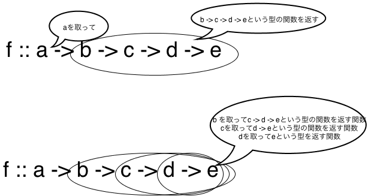
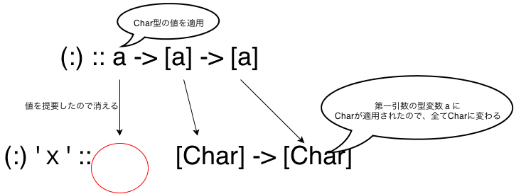

#高階関数
Tutorial for ゆるふわHaskell入門会

-----------------------------------------

###高階関数？
####前提条件
* Haskellでは関数も値
  * 格好良く、関数が「第一級オブジェクトである」なんて言います
* 数学的な意味での関数は「一つの値を取って」「一つの値を返す」
* Haskellの関数は数学的な意味での関数

####この事から導き出せる事
* 関数は値なので「関数を取る関数」を定義できる
  * 関数は「一つの値」を取るのでした
* 関数は値なので「関数を返す関数」を定義できる
  * 関数は「一つの値」を返すのでした

####高階関数とは
簡単に言ってしまうと、関数を引数に取ったり、関数を返したりする関数をひっくるめて、高階関数と言います。

-----------------------------------------

###改めてカリー化の話

さて、先程上で述べたように、Haskellの関数は「数学的な意味での関数」になります。  
つまり、引数を一つだけ取って、計算した結果を一つだけ返す関数という事です。

しかし、ここまで当たり前のように「二つ以上の引数を取る関数」を扱ってきました。  
```haskell
*Main> :t max
max :: Ord a => a -> a -> a
```
これは一体どういう事でしょうか。  
実は今まで「複数の引数を取る関数だと思っていたものは、「関数を返す関数」だったのです。

次の型を見てください。  
```haskell
f :: a -> b -> c -> d -> e
```
この型が、一つの値を取って関数を返す型であるというのは、次のようにイメージすれば良いかと思います。



関数の型を表す演算子`->`は右結合である、と言ったほうが解り良い人も居るかもしれません。  
つまり、この型は、以下の表記のかっこを省略したものなのです。
```haskell
f :: a -> (b -> (c -> (d -> e)))
```

####カリー化？

カリー化とは「複数の引数を持つ関数」を、「関数を返す関数」に変換する操作を指します。
Haskellの関数は、初めから「複数の引数を取る関数」が「関数を返す関数」になるので、型の説明をした際に『Haskellの関数は全て「カリー化」されている』と言ったわけです。  

この「カリー化」という言葉、度々「部分適用」（後ほどすぐに説明します）と混同して使われる事があるため、注意してください。  

時間があれば、ここで簡単に、「カリー化」と「部分適用」の違いについて説明します。

-----------------------------------------

###高階関数の基本
####部分適用

さて、これでHaskellの型が何故このような表記になっているか、なんとなく解っていただけたんじゃないかと思います。  
今度は具体的な例を使って、上記で述べた事を確認してみましょう。

`(:)`は「リストの先頭に値を追加する」演算子でしたね。  
この演算子を( ) でくくって前置記法にし、引数を一つだけ適用して型がどう変化するか確かめてみましょう。
```haskell
(:)     :: a -> [a]    -> [a]
(:) 'a' ::      [Char] -> [Char]
```
最初の引数`a`に`Char`を適用した事によって、「`[Char]`を取って`Char`を返す関数」を得た事になります。  




（問）CharやBoolははOrd型クラスのインスタンスです。  
max関数やmin関数のCharやBool型の値を一回だけ適用した結果の型がどのようになるか、予想してみましょう。  
また、予想した通りの結果になるか、GHCiを使って確認してみましょう。
```haskell
*Main> :t max
max :: Ord a => a -> a -> a
*Main> :t min
min :: Ord a => a -> a -> a
```

####関数を引数に取る関数
次のような型を持つ関数 f について考えてみましょう。
```haskell
f :: (Int -> a) -> a
```
先ほど`->`は右結合だ、という話をしました。  
この場合は、`Int -> a`がかっこでくくられているの、`Int -> a`が優先されます。  

つまり、関数`f`は、`Int -> a`を引数に取り、`a`を返す関数になるわけです。
実装はIntの値の数だけ考える事ができますが、ひとまず第一引数の関数に`5`を適用して返す実装例を、以下に示します。
```haskell
f :: (Int -> a) -> a
f a = a 5
```
（問）上の`f`のような関数を実装し、GHCiで動作を確認してみましょう。
色々な関数を引数として渡してみて下さい。以下はその一例です。
```haskell
*Main> f show
"5"
```

（問）次のような型を持つ`app`関数が、どのような性質を持つか考えてみましょう。また、その具体的な関数を実装してみましょう。
```haskell
app :: a -> (a -> b) -> b
```

-----------------------------------------

###ちょっと便利な関数記法
高階関数を使うにあたって、「局所的な小さな関数を短い記述で作る」テクニックがすごく重要になってきます。  
そのために、Haskellで使う事ができる、セクションとラムダ式という記法について説明します。

####セクション
今まで、足し算等の演算子をかっこでくくる事によって、前置関数として使えるというのをちょくちょく取り入れてきましたが、感覚は掴めたでしょうか？  
さらにHaskellには、演算子の右辺、あるいは左辺のみ値を適用した、セクションという記法を使う事ができます。
```haskell
(+) 1 :: Num a => a -> a
(+1)  :: Num a => a -> a
(1+)  :: Num a => a -> a
```
足し算の演算は結合則を満たす（1 + 2 + 3を、1 + 2から計算しても、2 + 3を計算しても4という同じ結果を返す、という性質がある）ので、同じになってしまっていますが、結合則を満たさない`(:)`演算子を見てみると、解りやすいと思います。
```haskell
(:)    ::          a -> [a] -> [a]
(1:)   :: Num a =>      [a] -> [a]
(:[1]) :: Num a => a ->        [a]
```

####ラムダ式
ラムダ式は、Haskellで「名前の無い関数を手軽に作る」ための記法です。
```haskell
(\x -> x * 2) :: Num a => a -> a
(\x y -> x + y) :: Num a => a -> a -> a
```
```haskell
*Main> (\x -> x * 2) 2
4
*Main> (\x y -> x + y) 5 3
8
```
引数 x と y を受け取って加算した結果を返す`add`は次のように宣言できましたが...
```haskell
add :: Num a => a -> a -> a
add x y = x + y
```
これは、次のようにラムダ式を使って書いた場合にも同じです。
```haskell
add :: Num a => a -> a -> a
add = \x y -> x + y
```

あくまで表記上の問題ですが、関数を返す高階関数である事を明示したい場合、次のようにして、わざとラムダ式を交えて書く事もあります。
```haskell
addx :: Num a => a -> a -> a
addx x = \y -> x + y
```

-----------------------------------------

###関数プログラミングの世界へようこそ！
ここまでHaskellの基本中の基本をざっくりと説明してきました。  
  
型をベースにしてプログラムを考える感覚は掴んできたでしょうか？  
関数に値を部分適用していく事によって、型が変化していくイメージは掴めたでしょうか？

さあ、皆さん!!**ここからがHaskellです!!**

-----------------------------------------

###curry化関数

ところで、「二つ引数を取る関数」は、「ペアを引数に取る関数」に言い換える事ができると思いませんか？  
Haskellではペアを二値のタプルで表現する事ができました。
```haskell
f :: (a, b) -> c
```
そして、このような型を持った関数`f`を次の関数`g`に書きかえるのが、カリー化という操作でした。
```haskell
g :: a -> b -> c
```
`f`の型をもった関数を、`g`の型をもった関数に変換する`curry`という関数を考える事がはできないでしょうか？
型は次のような感じになりそうです。
```haskell
curry :: ((a, b) -> c) -> a -> b -> c
```
次のようにすれば、この型を満たす関数を実装する事ができます。
```haskell
curry :: ((a, b) -> c) -> a -> b -> c
curry f x y = f (x, y) 
```
（問）逆に`g`の型から`f`の型に変換する関数`uncurry`はどのような型になるでしょうか？

####標準ライブラリのcurryとuncurry

実はこの関数`curry`と`uncurry`はHaskellの標準ライブラリに実装があります。
```haskell
*Main> :t curry
curry :: ((a, b) -> c) -> a -> b -> c
*Main> :t uncurry
uncurry :: (a -> b -> c) -> (a, b) -> c

```

-----------------------------------------

###高階関数クイズ
次の型を持った関数`f`に、どんな意味があるか解りますか？
```haskell
f :: (a -> b -> c) -> b -> a -> c
```

次のように書きかえると、イメージしやすいかもしれません。
```haskell
f :: (a -> b -> c) -> (b -> a -> c)
```
これは関数の１つめの引数と、二つ目の引数を入れ替える関数だと考える事ができます。  
実装は次のような感じになるでしょう。
```haskell
f :: (a -> b -> c) -> b -> a -> c
f g y x = g x y 
```
この関数`f`は、`flip`という名前で、標準ライブラリに入っています。
```haskell
*Main> :t flip
flip :: (a -> b -> c) -> b -> a -> c
```

続けます。次の型をもった関数`f`はどんな動作をするでしょうか？
```haskell
f :: (a -> b -> c) -> [a] -> [b] -> [c]
```
これは、次のように２つのリストに次々に関数を適用していく関数と考えれば良さそうです。


この関数もやはり、標準ライブラリに`zipWith`という関数名で入っています。
```haskell
*Main> :t zipWith
zipWith :: (a -> b -> c) -> [a] -> [b] -> [c]
```
何故`zip`関数と同じ`zip`という名前が付いているのか、次のように型を並べてみると解りますね。
```haskell
zip     ::                  [a] -> [b] -> [(a, b)]
zipWith :: (a -> b -> c) -> [a] -> [b] -> [c]
```
`(,)`は二値のタプルを作る関数です。これを利用して以下のように`zipWith`から`zip`を実装する事ができます。
```haskell
myZip :: [a] -> [b] -> [(a, b)]
myZip = zipWith (,)
```

時間があったらここで`zipWith (,)`が`zip`と同じになる事を、型を使って確認してみましょう。

-----------------------------------------

###リストの操作には高階関数を使え
####map、foldl、foldr関数

続いて、Haskellの数ある高階関数でもとびっきり強力な`map`関数`foldl` `foldr`関数を紹介しましょう。

`map`関数はリストの全ての要素に任意の関数を適用する関数です。
```haskell
map :: (a -> b) -> [a] -> [b]
```
```haskell
*Main> map (*2) [1,2,3,4]
[2,4,6,8]
*Main> map show [1,2,3,4]
["1","2","3","4"]
```
`map`のような関数の事を「射影関数」と呼びます。  
「射影関数」はずっと先の`Functor`を理解するのに重要なファクターです、この型の形をきっちりと頭に入れておきましょう。

map関数に対して、リストの要素に右から、あるいは左から次々と関数を適用していくのがfoldl関数、foldr関数です。
```haskell
foldl :: (a -> b -> a) -> a -> [b] -> a
foldr :: (a -> b -> b) -> b -> [a] -> b
```
`foldl`関数は、次のようにしてリストの左側から順に関数を適用していきます。
```haskell
foldl (+) [1, 2, 3, 4, 5] 
  == ((((1 + 2) + 3) + 4) + 5)
```
対して、`foldr`関数は、次のようにしてリストの右側から順に関数を適用していきます。
```haskell
foldr (+) [1,2,3,4,5]
  == (1 + (2 + (3 + (4 + 5))))
```
`foldl`や`foldr`のような操作を「畳み込み」と言います。

####再帰を使ったら負けだと思っている

改めて、通常プログラミングで、繰り返し処理が必要になるのは、どのような場合か考えてみましょう。  
ほとんどの場合、配列やリストや、ストリーム等のシーケンスデータに対して操作を行う場合がほとんどかと思います。  

Haskell、もとい関数型プログラミングでは、そういった処理は対象の連続したデータに対して、汎用的に使えるmapのような関数を定義して使うのが基本です。  
通常、射影も畳み込みも（内部処理についてはひとまず置いといて）リストというデータ構造に対する操作であり、「繰り返し処理を記述する」という考え方はあまりしません。

そのようにして、汎用的な高階関数を組み合わせる事によって、視界から「繰り返し」という要素を極力排除し、見通しの良いプログラムを書くのが、関数型のアプローチです。  

-----------------------------------------

###超汎用的な高階演算子
####($)演算子

さて、プログラムが複雑になってくると、カッコのネストが気になってきます。  
例えば、関数、`f` `g` `h` が存在して、`x`を`h` `g` `f`の順に適用しようとした場合、通常次のような書き方になるでしょう。
```haskell
f (g (h x))
```
そんな時は、次の型を持った`($)`演算子を使うことができます。

```haskell
($) :: (a -> b) -> a -> b
```

型を見ればわかる通り、単純な動作としては面白いものでは無いですが...

```haskell
f a == f $ a
```

次のようにして、カッコの代わりような働きをさせる事ができます。

```haskell
f $ g $ h x
```

####関数合成

関数同士を繋ぐ場合や、高階関数に渡す関数を作る場合等に、関数合成を使うと便利です。
```haskell
(.) :: (b -> c) -> (a -> b) -> a -> c
```
この演算子も、次のように型にかっこを付け足すと、何をするための関数なのか明瞭でしょう。
```haskell
(.) :: (b -> c) -> (a -> b) -> (a -> c)
```

($)や(.)を上手く使う事によって、複雑なコードも可読性を落とさずに記述する事ができます。  

二つの関数`f`と`g`を(.)演算子でつないだ時、次のようになります。  
```haskell
f :: b -> c
g :: a -> b

f . g :: a -> c
```
先ほどの`f (g (h x))`という関数は、次のように書きかえる事ができますね。
```haskell
(f . g) x
```
`($)`と組み合わせて、次のように書くともっとすっきりします。

```haskell
f . g $ x
```

(問)次のようにして、`foldl`関数の最初の関数に関数合成を与える事は可能でしょうか。型をベースに考えてみましょう。
```haskell
foldl (.) :: ...？
```

-----------------------------------------

###ポイントフリースタイル

-----------------------------------------

以上、これで@its_out_of_tuneによるチュートリアルは終わりです。お疲れ様でした。  
演習問題等用意してきましたので、残りの時間は只管手を動かして、Haskellをモノにしていきましょう！！


